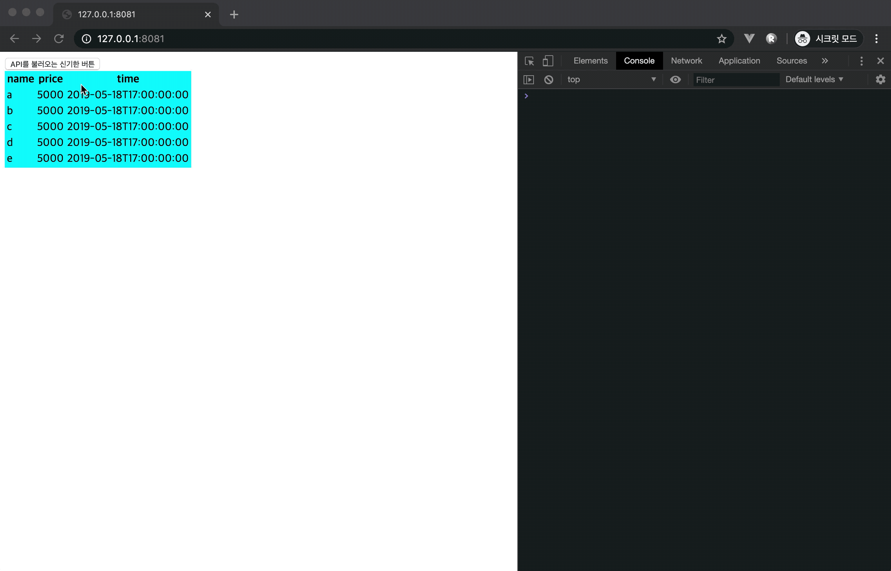

# Simple VanillaJS Library

다른 라이브러리들을 최대한 배제하고 제작한 라이브러리 입니다.

Vue, React, Cocos2d의 구조를 생각해보며 만들었지만 뜻대로 되지는 않았습니다.

### 중요!!
모든 컴포넌트들은 `src/components/common/component.js`를 상속받아야 합니다!!

### 아래처럼 동작합니다.
